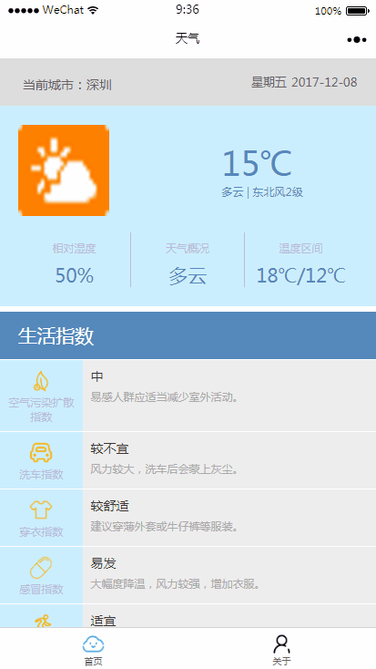

<h1 align="center" style="margin-bottom: 20px;">天气指数小程序</h1>

<code>版本号:1.0</code>

来源: [雷小天博客](http://www.100txy.com)

作用: 个人学习小程序入门案例

## 特性

| 支持特性 | 根据当前城市获取天气情况和生活指数,上拉还是可以刷新的

## 相关截图

## 相关文章

* [微信小程序如何加载数据库真实数据？](http://www.100txy.com/article/102.html)
* [微信小程序将html转为wxml开发案例](http://www.100txy.com/article/101.html)
* [微信小程序消息推送配置案例](http://www.100txy.com/article/90.html)

## 捐献

* 参见雷小天博客[捐献作者](http://www.100txy.com)

## 来源
[雷小天个人博客](http://100txy.com)
独立开发

*可在网站点击公众号扫描二维码进入我们的微信公众号
[雷小天博客](weixin.jpg)
*其他方式:合作qq：1124378213
